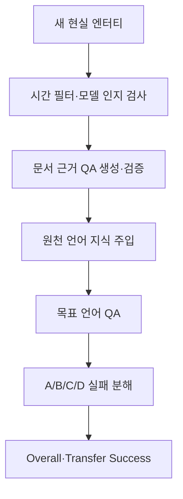
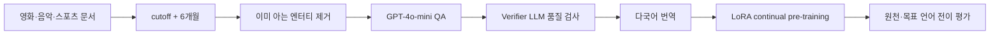

# LiveCLKTBench — 학습 보고서

- 원문: [ACL Anthology PDF](https://aclanthology.org/2026.acl-long.694.pdf)
- 서지: Guo et al., *ACL 2026*, pp. 15193–15208
- 분석 방식: 구조·핵심 내용 / 배경지식 / Figure·Table·근거 검증 서브에이전트 3명의 원문 분석을 통합함

## 1. Executive Summary

LiveCLKTBench는 새 LLM이나 전이 학습 알고리즘이 아니라, **새 현실 문서를 한 언어로 post-training한 뒤 다른 언어에서 그 사실을 재현하는지** 평가하기 위한 갱신형 벤치마크 생성 파이프라인입니다 (§1–§3, pp. 15193–15197). 영화·음악·스포츠의 시간 민감 엔터티를 고르고, 지식 절단일 이후 최소 6개월·모델 인지 여부 검사로 사전 노출 위험을 낮춥니다 (Figure 1, p. 15194; §3.1, p. 15196).

이 절차는 누수 위험을 줄이는 설계이지, 완전한 `leakage-free`를 증명하지는 않습니다. 사례 연구는 5개 언어·3개 도메인·6개 공개 instruction 모델과 LoRA 기반 continual pre-training에 한정됩니다 (§4–§5, pp. 15198–15200). 따라서 새 지식의 언어 간 재현을 평가하는 좋은 통제 도구이지만, 모든 실제 다국어 서비스·모든 전이 방법의 성능 결론은 아닙니다.

## 2. Glossary

| 용어 | 논문 안에서의 의미 | 읽기 포인트 | 위치 |
|---|---|---|---|
| 교차언어 지식 전이 | 한 언어에서 습득·주입한 사실을 다른 언어에서 재현 | 요약·지시 이행 같은 기술 전이와 다릅니다. | §1; §2.2 |
| 지식 누수/오염 | 목표 언어에서 이미 학습한 사실을 전이로 오해할 위험 | 이 논문의 핵심 문제 설정입니다. | §1; Figure 1 |
| knowledge cutoff | 사전학습 지식이 더 이상 반영되지 않는다고 가정한 시점 | 이 논문은 최소 6개월 후 엔터티를 선택합니다. | §1; §3.1 |
| knowledge injection | 원천 언어 문서로 post-training해 사실을 넣는 단계 | 사례 연구에서는 continual pre-training을 사용합니다. | §3.2 |
| A/B/C/D matrix | 양쪽 정답/원천만 정답/목표만 정답/양쪽 오답 | 실패 원인을 분해합니다. | §3.3; Table 1 |
| Overall Success | `A/(A+B+C+D)` | 원천 습득과 목표 재현을 함께 반영합니다. | Eq. 1, p. 15197 |
| Transfer Success | `A/(A+B)` | 원천 언어에서 맞힌 사례에 한정한 조건부 전이율입니다. | Eq. 2, p. 15197 |
| LoRA | rank 16, α=32로 쓴 파라미터 효율적 post-training | 전이 결과는 이 특정 학습 설정의 결과입니다. | §4, p. 15199 |

**필수 선수지식:** 사전학습·후속학습·지식 절단일, 다지선다 QA, 조건부 확률, 데이터 누수, 다국어 전이. 특히 Transfer Success와 Overall Success는 같은 점수가 아닙니다.

## 3. Paper Walkthrough

### 문제 정의와 기존 접근

**논문 직접 주장:** 목표 언어에서 사실 QA를 맞혀도 그것이 다른 언어에서 온 지식 전이인지, 사전학습에서 이미 본 사실인지 기존 평가만으로 분리하기 어렵습니다 (§1, pp. 15193–15194). 신뢰할 수 있는 평가에는 누수 저감·현실 문서·지속 갱신이 필요하다고 제시합니다.

### 핵심 아이디어와 제안 방법

영화(IMDB/TMDB), 음악(YouTube Music), 스포츠(SportsDB/Sports.io)의 시간 민감 엔터티를 수집하고, 6개월 시점 필터와 모델 자체 요약·LLM judge로 이미 알려진 항목을 제거합니다 (§3.1, pp. 15195–15196; Figure 1). GPT-4o-mini가 문서 근거 4지선다 QA를 만들고 verifier LLM이 문서 근거·사실성·정답 유일성을 확인합니다 (Figure 2, p. 15196). 이후 원천 언어 문서는 train, 다국어 QA는 test로 사용합니다 (§3.1, p. 15197).

### 실험과 결과

**실험·데이터가 직접 보여주는 것**

- 사례 연구는 영어·프랑스어·스페인어·일본어·중국어, Gemma-2-9B·Qwen2.5-7B·Ministral-8B·Mistral-Nemo·Llama-3.1-8B·OLMo-2-7B로 진행했습니다 (§4, pp. 15198–15199).
- Table 2에서 Gemma-2-9B는 평균 Overall .414로 가장 높고, Qwen2.5-7B는 평균 Transfer .747로 가장 높습니다. 두 지표가 다른 질문임을 보여 줍니다 (§5.1, p. 15199; Table 2, p. 15198).
- Table 2에서 스포츠는 모든 열거 모델에 대해 음악·영화보다 낮습니다. 예: Gemma Overall은 음악 .494, 영화 .483, 스포츠 .265입니다 (§5.1; Table 2).
- Figure 3은 전이 방향이 대칭적이지 않음을 보입니다. Gemma는 EN→JA .59, JA→EN .69이지만 Qwen은 EN→JA .69, JA→EN .64입니다. 즉 방향 패턴도 모델별로 다릅니다 (§5.2, p. 15200; Figure 3).
- Figure 4에서 계열 내 크기 증가와 성능 상승 경향이 보이지만, 모델 세대·학습 데이터·토크나이저도 함께 변하므로 파라미터 수의 단독 인과 효과는 증명하지 않습니다 (§5.3, p. 15200).

**논문의 해석:** 언어적 거리, 전이 방향, 도메인, 모델 크기가 지식 전이 성능에 영향을 줍니다 (§5.2–§5.3).

**우리의 해석:** 한국어 질의와 영어 원문을 함께 쓰는 RAG/지식 업데이트 시스템에서도, 검색 성공·문서 번역·지식 주입·답변 언어를 분해해 평가해야 합니다. 이 논문은 한국어와 실제 RAG를 실험하지 않았으므로 직접 성능 근거는 아닙니다.

### 한계

다지선다 QA·3개 도메인·5개 언어에 한정되고, 시간 필터와 인지 검사는 오염 위험을 낮출 뿐 잠재 지식·사전 노출을 완전히 배제하지 못합니다 (Limitations, p. 15201). 사람 번역 평가는 EN→JA/FR/ZH만 다루며, 스페인어·양방향 번역 범위는 충분히 검증되지 않았습니다 (Appendix C; Table 4, p. 15205).

## 4. Concept Map

## 5. Method Diagram

## 6. Evidence Table

| 주장 | 원문 근거 | 위치 | 근거 강도·주의 |
|---|---|---|---|
| 최신 엔터티·6개월 필터·인지 검사로 벤치마크를 생성 | 엔터티 수집→필터→모델 요약 비교→QA 생성 순서 | §1; §3.1; Figures 1–2 | 강함(절차). 완전한 무오염 보장은 약함; 잠재 지식은 배제하지 못함. |
| verifier 통과 QA의 사람 검수 pass rate는 95.2% | 20% 엔터티 표본·3명 합의 항목의 검수 결과 | Appendix B, p. 15204 | 중간. 불일치 문항 제외·표본 한정이라 전체 QA 무오류 증거가 아님. |
| Gemma는 Overall, Qwen은 Transfer 최고 | Gemma .414/.735, Qwen .387/.747 | §5.1; Table 2 | 강함(사례 설정). 지표·6개 모델·3도메인 범위에 한정. |
| 스포츠가 다른 두 도메인보다 낮다 | 모든 열거 모델에서 스포츠 점수가 가장 낮음 | §5.1; Table 2 | 강함(표의 관찰). 원인을 언어 전이로 단정할 수 없음. |
| 전이 방향은 비대칭적이다 | 언어쌍 heatmap의 비대칭 값 | §5.2; Figure 3 | 강함(이 5언어·6모델 관찰). 언어 자체의 우열 인과 결론 불가. |
| 큰 모델에서 향상이 포화될 수 있다 | 계열·도메인별 scatter와 저자 서술 | §5.3; Figure 4 | 중간. size 외 요인이 함께 달라지는 기술적 비교. |
| 번역 adequacy는 높고 fluency는 개선 여지가 있다 | EN→JA/FR/ZH 사람 평가 | Appendix C; Table 4 | 중간. 스페인어·양방향·저자원 언어 미검증. |

## 7. Caveats

1. `leakage-free`는 완전 보증이 아니라 위험 감소 절차입니다. cutoff 정확도·웹 노출·요약에서 드러나지 않는 잠재 지식은 남을 수 있습니다.
2. Transfer Success의 분모 `A+B`가 작으면 값이 불안정할 수 있으나 원문은 분모 수·신뢰구간을 충분히 제시하지 않습니다.
3. validation/test는 같은 지식 문서에서 갈라진 QA이므로 새로운 문서·새 엔터티 일반화가 아니라 주입된 사실의 재현을 봅니다 (Appendix A, p. 15204).
4. 언어 거리·중국어 노출·크기 효과의 원인은 통제 실험으로 분리되지 않았습니다.

## 8. Open Questions

1. 한국어와 저자원 언어를 포함하면 방향 비대칭은 어떻게 달라질까요?
2. 동일 지식을 SFT·knowledge editing·RAG로 제공하면 Transfer Success가 어떻게 달라질까요?
3. 자유 생성형 QA에서도 다지선다 결과가 유지될까요?
4. 시간 필터·인지 검사의 잔여 누수를 독립 데이터 감사로 어떻게 측정할 수 있을까요?

## 9. Follow-up Reading

| 자료·개념 | 필요한 이유 |
|---|---|
| continual pre-training·SFT·knowledge editing 비교 | 이 벤치마크가 지원하는 다른 지식 주입 전략을 이해하기 위해 필요합니다. |
| LoRA·파라미터 효율적 미세조정 | 사례 연구의 통일된 post-training 조건을 해석하기 위해 필요합니다. |
| 데이터 오염·knowledge cutoff 감사 | 누수 위험 감소와 완전 무오염 보장의 차이를 이해하기 위해 필요합니다. |
| 다국어 번역 adequacy·fluency 평가 | 문서 의미 보존과 자연스러움을 분리해 보기 위해 필요합니다. |

**학습 실험 제안:** 공개 문서의 새 사실 20개를 영어로 주입한 뒤 한국어·영어 질의에서 A/B/C/D를 기록하세요. 그러면 정답률 하나가 아니라 지식 습득 실패와 언어 전이 실패를 분리한 DS 평가 프로젝트가 됩니다.
