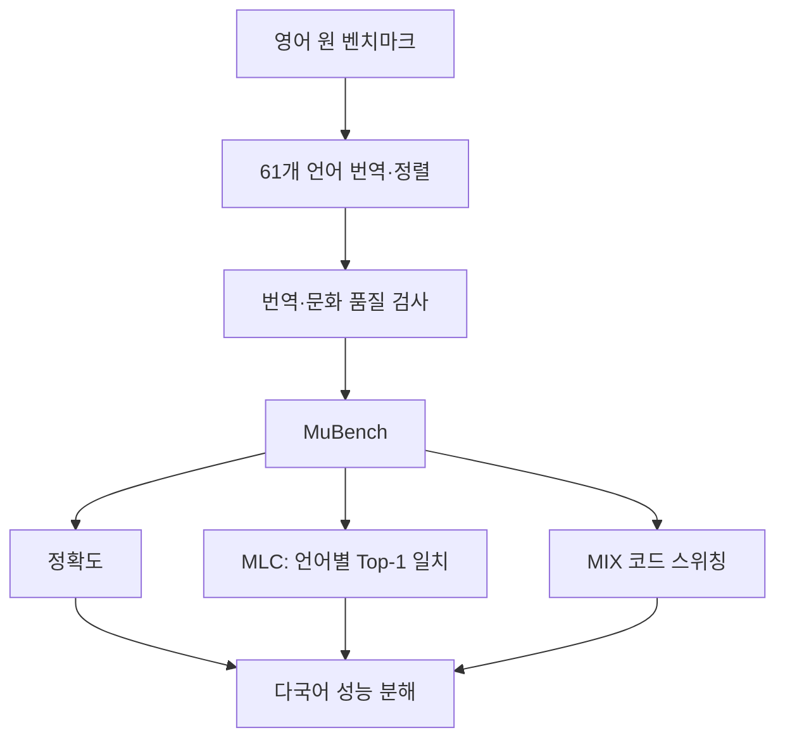
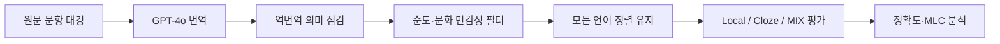

# MuBench — 학습 보고서

- 원문: [ACL Anthology PDF](https://aclanthology.org/2026.findings-acl.794.pdf)
- 서지: Han et al., *Findings of ACL 2026*, pp. 16163–16192
- 분석 방식: 구조·핵심 내용 / 배경지식 / Figure·Table·근거 검증 담당의 원문 분석을 통합함

## 1. Executive Summary

MuBench는 새 모델이 아니라, **61개 언어·12개 과업·6개 능력군**을 같은 문항 기준으로 정렬해 다국어 LLM을 평가하는 벤치마크입니다 (§1–§3, pp. 16163–16167; Table 1). 새로 제안한 MLC는 같은 문항의 두 언어판에서 모델이 같은 Top-1 선택을 하는 비율입니다 (§4.3, p. 16169). 즉 정확도와 함께 언어 전환 시 답이 흔들리는지를 보려는 지표입니다.

최종 데이터는 3,921,751개 샘플로 보고됩니다 (Table 2, p. 16166). 그러나 이 수치를 61개 언어 각각에 독립적으로 390만 개가 있다고 읽으면 안 됩니다. 번역·역번역·순도·문화 민감성 필터를 자동화했고 17개 언어 약 34,000개 샘플을 사람 평가로 검증했습니다 (§3.1–§3.3, pp. 16165–16167). 영어 기반 번역 벤치마크이므로 지역 고유 지식·자연발생 코드 스위칭을 완전히 평가하지는 못합니다 (Limitations, pp. 16170–16171).

## 2. Glossary

| 용어 | 논문 안에서의 의미 | 읽기 포인트 | 위치 |
|---|---|---|---|
| MuBench | 61개 언어, 12개 과업을 정렬한 다국어 평가셋 | 언어 수보다 같은 문항을 비교 가능하게 정렬한 점이 핵심입니다. | §1; Table 1 |
| 교차언어 정렬 | 한 문항의 언어별 번역본을 대응시키고 한 언어에서 제외하면 모두 제외 | 점수 차이가 시험지 차이가 아닌 언어 조건 차이인지 보려는 통제입니다. | §3.2, p. 16167 |
| MLC | 두 언어판에서 같은 Top-1 답을 낸 비율 | 정답과 무관한 일치도이므로, 높아도 같은 오답일 수 있습니다. | §4.3, p. 16169 |
| Rel-MLC | MLC를 언어쌍 평균 정확도로 보정한 지표 | 정확도 영향은 줄이지만 완전히 제거되었다고 검증되지는 않았습니다. | §4.3, p. 16169 |
| Cloze / Local template | 우도 기반 빈칸 완성형 / 목표 언어 지시를 쓰는 형식 | 평가 형식이 바뀌면 점수도 바뀔 수 있습니다. | §3.1; §4.1 |
| MIX | 문항 구성요소를 확률적으로 다른 언어로 바꾼 합성 코드 스위칭 | 자연발생 다국어 대화가 아닙니다. | §4.4, p. 16170 |
| ACC·ACC_NORM·EM | 정확도·선택지 길이 보정 정확도·정확 일치 | GPT-4o와 공개 base 모델은 같은 프로토콜이 아니므로 절대 순위 비교 금지입니다. | §4.1, p. 16168 |

**선수지식:** 다지선다 정확도, 번역 기반 벤치마크 설계, 사전학습/base 모델, 코드 스위칭, 언어 계통·형태론. 먼저 “같은 답”과 “정답”의 차이를 이해해야 MLC를 오해하지 않습니다.

## 3. Paper Walkthrough

### 문제 정의와 기존 접근

**논문 직접 주장:** 기존 벤치마크는 언어 수·능력 범위·동일 문항 정렬·코드 스위칭 중 하나 이상이 부족해, 언어별 정확도만으로 언어 간 견고성이나 지식 전이를 비교하기 어렵습니다 (§1, pp. 16163–16164; Table 1).

### 핵심 아이디어와 방법

영어 원 벤치마크(SNLI, MultiNLI, WinoGrande, HellaSwag, BMLAMA, MMLU, GPQA, TruthfulQA 등)를 61개 언어로 확장합니다 (§3, p. 16165; Figure 1; Table 2). GPT-4o 번역→역번역 의미 점검→순도→문화 민감성 필터→재번역을 적용하고, 문화 민감 문항은 모든 언어에서 함께 제외합니다 (§3.1–§3.2, pp. 16165–16167; Figure 2).

### 실험과 결과

**실험이 직접 보여주는 것**

- Table 5에서 다수 모델이 영어 대비 비영어 평균에서 하락합니다. 예를 들어 GPT-4o의 MultiNLI 평균은 69.78, 영어 대비 -11.18%p이고 WinoGrande는 71.68, -10.35%p입니다 (§4.1, p. 16168; Table 5).
- 모델 크기를 키워도 영어 대비 격차가 과업마다 일관되게 줄지 않았습니다 (§4.1, p. 16169; Table 5).
- MLC는 `MLC(l,l′)=1/|N| Σ 1[cᵢ=cᵢ′]`로 정의됩니다. 여기서 `cᵢ`는 각 언어에서의 Top-1 선택이며 정답 여부는 반영하지 않습니다 (§4.3, p. 16169).
- MIX에서는 작은 모델이 영어 혼입 덕분에 단일언어 평균보다 높게 나오는 사례도 있었고, Qwen 계열이 Gemma 계열보다 안정적이었다고 저자들이 보고합니다 (§4.4, p. 16170; Figure 4).

**논문의 해석:** 정확도·MLC·코드 스위칭 결과를 함께 보면 언어별 다국어 병목을 더 진단할 수 있습니다 (§4.3–§4.4).

**우리의 해석:** 한국어·영어·혼합 언어 사용자 요청을 평가할 때 평균 정확도 외에 언어별 답 일치·형식 준수·근거 사용을 별도 기록하는 실험 설계에 쓸 수 있습니다. MuBench가 실제 한국어 서비스 품질을 직접 증명하는 것은 아닙니다.

### 한계

영어 벤치마크 번역 기반이라 지역화 지식을 재지 못하고, 61개 언어 중 사람 검증은 17개 언어에 한정됩니다. MIX는 합성 혼합 언어이며, 자동 문화·번역 검사는 미세한 오류를 놓칠 수 있습니다 (Limitations, pp. 16170–16171).

## 4. Concept Map

## 5. Method Diagram

## 6. Evidence Table

| 주장 | 원문 근거 | 위치 | 근거 강도·주의 |
|---|---|---|---|
| MuBench는 61언어·12과업·6능력군·3,921,751 최종 샘플을 제공 | Table 1·2의 구성·합계 | §1; Tables 1–2 | 강함. 390만의 언어 variant 단위는 명확하지 않아 61배로 확대 불가. |
| 번역 품질을 자동·사람 검수로 점검했다 | 17언어×2,000 사람 검증, GPT 평가 비교 | §3.3; Tables 3–4 | 중간. 나머지 44언어는 사람 검증 범위 밖이며 자동 judge의 독립성 한계가 있음. |
| 영어 대비 비영어 성능 저하가 관찰된다 | 모델·과업별 Table 5의 음수 차이 | §4.1; Table 5 | 중간~강함. 24 모델·선택 과업의 평균이지 실제 업무 전체가 아님. |
| MLC와 정확도는 다른 정보를 준다 | MLC 정의와 언어쌍 표 | §4.3; Table 11 | 중간. MLC는 같은 오답도 세므로 공유 지식·공정성의 직접 증거가 아님. |
| 코드 스위칭에서 큰 모델이 항상 강건하지는 않다 | 합성 MIX−Local 차이 Figure 4 | §4.4; Figure 4 | 중간. 자연발생 코드 스위칭이 아니고 CI·seed 불확실성 보고가 제한적. |
| 언어 계통 내부에서 MLC가 높은 경향 | Qwen3-14B BMLAMA heatmap·family 평균 | §4.3; Figure 5; Table 12 | 중간. 연관성 관찰이며 학습 데이터·구조의 인과를 증명하지 않음. |

## 7. Caveats

1. Table 3 본문은 9개 언어라고 서술하지만 표에는 10개 언어가 있고, 유의성 서술도 표 수치와 완전히 일치하지 않습니다. 따라서 “번역 품질이 완전히 검증됐다”고 단정하면 안 됩니다 (§3.3; Table 3, p. 16167).
2. GPT-4o가 번역·역번역·judge 역할을 반복하므로 자동 품질 검수의 독립성은 제한적입니다.
3. GPT-4o와 공개 base 모델은 평가 템플릿·측정값이 달라 Table 5의 행을 단일 순위표로 읽으면 안 됩니다 (§4.1, p. 16168).
4. Appendix D의 병렬 말뭉치 결과는 1.2B LLaMA2, 영어–중국어/아랍어의 통제 실험이라 일반 학습 규칙이 아닙니다 (Appendix D; Figure 8, p. 16180).

## 8. Open Questions

1. 한국어 고유 지식·제도·문화 문항을 추가하면 결과는 어떻게 달라질까요?
2. 자연발생 코드 스위칭 대화에서도 MIX의 패턴이 재현될까요?
3. 높은 MLC가 낮은 정확도와 함께 나타날 때, 어떤 오류 분석이 필요한가요?
4. 상용 instruction 모델에서도 base 모델 중심 결과가 유지될까요?

## 9. Follow-up Reading

| 자료·개념 | 필요한 이유 |
|---|---|
| NLI와 SNLI/MultiNLI | MuBench에서 예외적인 10-shot local-template 과업을 읽기 위해 필요합니다. |
| MLC·Rel-MLC 통계 해석 | 정확도와 일치도를 함께 해석하는 방법을 익히기 위해 필요합니다. |
| 번역 품질 평가와 문화 타당성 | 역번역·LLM judge·사람 검수 각각의 한계를 비교하기 위해 필요합니다. |
| 자연발생 코드 스위칭 연구 | 합성 MIX와 실제 다언어 사용자 발화를 구분하기 위해 필요합니다. |

**학습 실험 제안:** 같은 질문을 한국어·영어·혼합 언어로 20개씩 만들고, 모델 두 개의 정답·형식 준수·언어별 답 일치·근거 인용을 나란히 기록하세요. 이는 다국어 평가 기준을 직접 설계한 DS 프로젝트가 됩니다.
