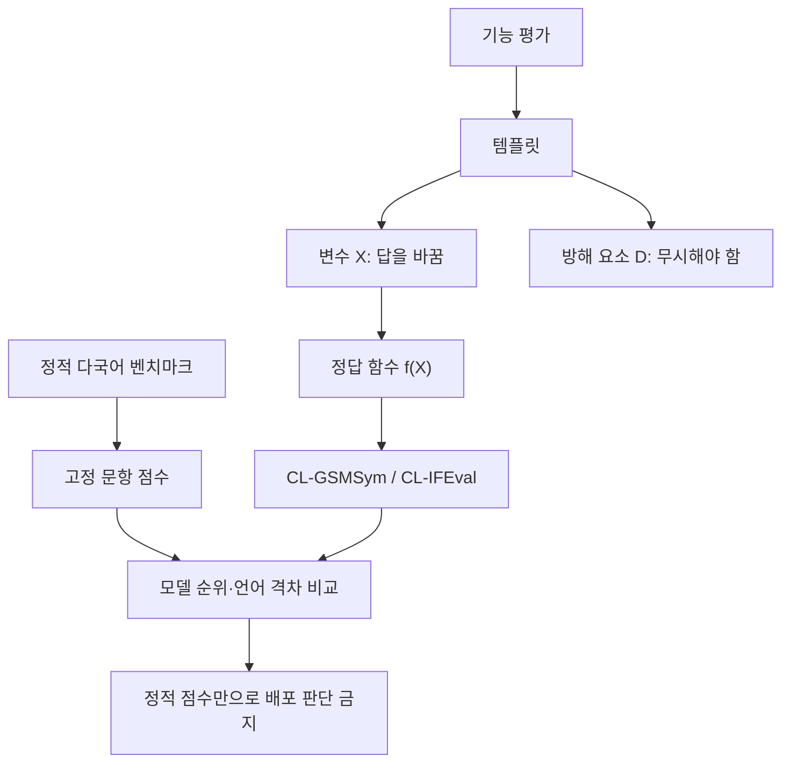
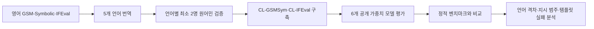

# Multi-lingual Functional Evaluation for Large Language Models — 학습 보고서

- 원문: [ACL Anthology PDF](https://aclanthology.org/2026.findings-acl.1731.pdf)
- 서지: Ojewale, Raji, Venkatasubramanian, *Findings of ACL 2026*, pp. 34672–34691
- 분석 방식: 구조·핵심 내용 / 배경지식 / 근거·세부 검증 서브에이전트 3명의 원문 분석을 통합함

## 1. Executive Summary

이 논문은 새 LLM이나 학습 방법을 제안하지 않습니다. 대신 기존의 고정 문제형 다국어 벤치마크만으로는 실제 지시 이행과 입력 변형에 대한 강건성을 충분히 판단하기 어렵다고 보고, **CL-GSMSym**과 **CL-IFEval**이라는 교차언어 기능 평가를 구축합니다 (§1–§3, pp. 34672–34674).

핵심 새로움은 템플릿 안에서 정답을 바꾸는 변수 `X`와 무시해야 하는 방해 요소 `D`를 바꾸며, 함수 `f(X)`로 정답을 검증하는 평가 설계입니다 (Figure 1, p. 34673). 여섯 개 공개 가중치 모델의 결과에서 기능 평가와 정적 평가가 모델 순위·언어별 성능 격차·실패 유형을 다르게 드러내는 사례를 보였습니다 (§5, pp. 34675–34677). 이는 “기능 평가가 항상 더 낫다”는 증명이 아니라, 다국어 배포 판단에 정적 점수 하나만 쓰기에는 부족할 수 있다는 실증입니다.

## 2. Glossary

| 용어 | 논문 안에서의 의미 | 읽기 전 알아둘 점 | 위치 |
|---|---|---|---|
| 정적 벤치마크 | M-MMLU, M-GSM, Belebele처럼 고정 문항·정답을 사용하는 평가 | 시험지 한 세트를 푸는 방식에 가깝습니다. | §1–§2, pp. 34672–34673 |
| 기능 평가 | 템플릿의 변수·방해 요소를 바꿔 여러 입력을 만들고 규칙으로 채점하는 평가 | 단순 암기보다 규칙 유지 여부를 보려는 설계입니다. | Figure 1, p. 34673 |
| 변수 `X` | 답을 바꾸어야 하는 입력 속성 | 예: 사과의 수량. | Figure 1, p. 34673 |
| 방해 요소 `D` | 답과 무관해 모델이 무시해야 하는 속성 | 예: 이름·색상. | Figure 1, p. 34673 |
| `f(X)` | 변수에서 정답을 계산하는 함수 | 예시에서는 `f(X)=n₁+n₂`; 통계 모델 수식이 아니라 정답 규칙입니다. | Figure 1, p. 34673 |
| CL-GSMSym | GSM-Symbolic를 5개 언어로 확장한 수학 추론 기능 평가 | 템플릿·수량·단위를 바꿔도 관계를 푸는지 봅니다. | §3, p. 34674; Table 1 |
| CL-IFEval | IFEval을 5개 언어로 번역·검증한 지시 이행 평가 | 길이·키워드·형식 같은 검증 가능한 제약을 채점합니다. | §3, pp. 34673–34674; Table 2 |
| strict / loose | CL-IFEval의 엄격/완화 채점 | 원 정확한 판정 규칙은 IFEval 원 논문도 함께 읽어야 합니다. | §4, p. 34674; Table 10 |
| prompt-level / instruction-level | 답 전체 통과와 개별 지시 통과를 구분한 점수 | 여러 지시가 있는 답변에서 서로 다른 질문입니다. | §4, p. 34674 |
| 언어 성능 격차 | 한 모델의 최고 언어 정확도−최저 언어 정확도 | 모델 전체 품질이나 언어 난이도의 원인을 직접 재지는 않습니다. | §5.2, p. 34676; Table 4 |

**필수 선수지식:** 정확도와 퍼센트포인트, 고정 문항과 변형 문항의 차이, 템플릿 기반 생성·규칙 기반 채점, 다국어 문자 체계, few-shot/CoT 프롬프팅. 특히 아랍어·힌디어에서는 대소문자 구분이 어려워 `change_case` 지시가 제외됐다는 점을 먼저 알아야 합니다 (§3, p. 34674; Table 2).

## 3. Paper Walkthrough

### 문제 정의

**논문 직접 주장:** 정적 다국어 벤치마크의 높은 점수는 언어가 달라진 실제 지시 이행이나 변형된 문제에 대한 견고성을 보장하지 않습니다 (§1, p. 34672). 영어 벤치마크의 학습 데이터 오염 가능성과 번역·문화 맥락 문제도 관련 위험으로 언급합니다 (§2, p. 34673).

### 기존 접근법

M-MMLU, M-GSM, Belebele은 미리 정한 질문·정답을 평가합니다. 이 논문은 이를 버리자는 것이 아니라, 기능적 평가를 **병행**해야 다른 실패 양상을 볼 수 있다고 주장합니다 (§2, p. 34673; §6, pp. 34677–34678).

### 핵심 아이디어와 제안 방법

영어 GSM-Symbolic 100개 템플릿과 IFEval 541개 프롬프트를 프랑스어·스페인어·힌디어·아랍어·요루바어로 번역한 뒤, 원어민 검증자가 의미·제약 강도·템플릿-인스턴스 정합성을 확인했습니다 (§3, pp. 34673–34674; Appendix F, pp. 34688–34689).

- **CL-GSMSym:** 언어별 100개 템플릿 × 50개 변형으로 본문상 언어당 5,000 QA 쌍을 만듭니다. 단, Table 1의 `5000` 표기가 전체/언어당 단위로 혼동될 여지가 있어 본문 설명을 우선했습니다 (§3, p. 34674; Table 1).
- **CL-IFEval:** `change_case`를 제외해 371개 프롬프트로 정제합니다. 따라서 여섯 언어의 문항 구성이 완전히 동일하지는 않습니다 (§3, p. 34674; Table 2).
- **평가:** Aya 23-35B, Aya Expanse-32B, Gemma-2-9B-it, Qwen3-8B, Mistral-7B-Instruct-v0.3, Mixtral-8x7B-Instruct-v0.1의 6개 공개 가중치 모델을 사용합니다 (§4, p. 34674; Appendix A.1, p. 34681). 수학 과업에는 해당 언어 CoT와 8-shot 설정을 썼습니다 (§4, p. 34674).

### 실험과 결과

**실험·데이터가 직접 보여주는 것**

- 영어 CL-IFEval strict prompt-level 정확도는 56.06%–87.60%로 31.54%p 범위였고, 비교한 Belebele 영어 점수 범위는 약 13.9%p였습니다 (§5.1, p. 34675; Tables 9·10·12, pp. 34682–34684).
- CL-GSMSym 영어 정확도는 Mistral-7B 48.6%, Qwen3-8B 86.8%였습니다 (§5.1, p. 34675; Table 11, p. 34683).
- Qwen3-8B의 고자원 언어 CL-IFEval 격차는 31.00%p, Belebele은 3.00%p였습니다. 다만 CL-GSMSym에서는 Qwen3-8B가 8.6%p, M-GSM이 14.4%p로 반대 예외도 있습니다 (§5.2, p. 34676; Table 4).
- 요루바어 `startend` 지시 범주에서 저자들이 평가한 모든 모델은 통과 응답을 내지 못했다고 보고합니다 (§5.3, p. 34677; Figure 3).
- 확률 추론 Template 3는 분석한 세 모델·여섯 언어에서 가장 약한 템플릿 계열로 보고됩니다 (§5.3, p. 34677; Figure 4; Appendix Figures 8–10).

**논문의 해석:** 위 차이는 정적 평가만으로 다국어 배포 모델을 고르면 기능 수행 관점의 다른 선택을 할 수 있음을 뜻합니다 (§5.1, p. 34675).

**우리의 해석:** 한국어·영어 서비스 평가에서도 평균 정확도 하나만 보고 끝내기보다, 실제 형식·근거·다단계 지시를 변형한 작은 기능 테스트를 병행하는 것이 안전합니다. 이 논문은 한국어를 평가하지 않았으므로 한국어 성능 결론으로 확대하면 안 됩니다.

### 한계

- Google Translate를 초벌 번역으로 사용했으며, 특히 요루바어와 단위 변환의 부정확 가능성을 저자들이 명시합니다 (Limitations, p. 34678).
- 비교 대상은 여섯 공개 가중치 모델뿐이라 상용·비공개 모델로 일반화할 수 없습니다 (Limitations, p. 34678).
- 아랍어·힌디어에서 `change_case` 지시를 제거해 언어 간 동일 난이도가 보장되지 않습니다 (Table 2, p. 34675).

## 4. Concept Map

## 5. Method Diagram

## 6. Evidence Table

| 주장 | 원문 근거 | 위치 | 근거 강도·주의 |
|---|---|---|---|
| 기능 평가에서 모델 간 차이가 더 크게 보인다 | 영어 CL-IFEval strict PL 56.06–87.60%; Belebele 영어 약 79.4–93.3% | §5.1, p. 34675; Tables 9·10·12 | 중간~강함. 여섯 모델·이 벤치마크에서의 관찰이며 모든 과업 일반화 불가. |
| 정적·기능 평가 사이에 모델 순위 역전 사례가 있다 | M-GSM과 CL-GSMSym에서 Aya 23-35B·Gemma-2-9B-it 비교 양상이 다름 | §5.1, p. 34675; Tables 11·14 | 중간. 본문 `일관되게`라는 표현은 아랍어 수치 예외가 있어 `대체로`로 읽는 것이 안전. |
| 기능 평가는 고자원 언어 간 격차를 더 크게 드러낼 수 있다 | Qwen3 CL-IFEval 31.00%p vs Belebele 3.00%p; Aya Expanse 25.88%p vs 4.22%p | §5.2, p. 34676; Table 4·Figure 2 | 중간~강함. CL-GSMSym 반대 예외가 있어 보편 법칙이 아님. |
| 요루바어 start/end 제약은 이 세팅에서 전 모델 실패 | Figure 3의 0 통과 응답 보고 | §5.3, p. 34677; Figure 3 | 중간. 원문에 seed·CI·원시 표본 수가 충분히 제시되지 않아 언어 능력 전체로 일반화 불가. |
| Template 3 확률 추론이 취약했다 | 세 모델·여섯 언어에서 최저 family라는 시각화·본문 서술 | §5.3, p. 34677; Figure 4; Appendix Figs. 8–10 | 중간. 전체 100개가 아닌 대표 10개 template family 범위. |
| 원어민 검증을 거쳤다 | 언어별 최소 2명, 의미·제약·오탈자·정합성 검토 | §3, pp. 34673–34674; Appendix F | 중간. 검증 절차는 확인되지만 IAA·오류율 수치는 없음. |

## 7. Caveats

1. Common Crawl 비율로 정한 고·중·저자원 구분은 데이터 가용성의 대리 지표이지 언어·화자 역량의 척도가 아닙니다 (Table 5, p. 34681).
2. `language performance gap`은 최고·최저 점수의 차이여서 원인을 식별하지 못합니다. 번역 품질, 토크나이저, 모델 학습량 등이 함께 작용할 수 있습니다 (§5.2, p. 34676).
3. Template 3의 취약점은 실제 확률 추론 전반이 아니라 선정된 10개 템플릿·3개 모델 분석에서의 관찰입니다 (Table 3, p. 34675; Figure 4).
4. 정적 평가보다 기능 평가가 더 유용하다는 결론은 저자의 주장이며, 이 실험은 선택된 여섯 모델·여섯 언어·벤치마크의 범위만 직접 검증합니다.

## 8. Open Questions

1. 한국어를 포함하면 CL-IFEval과 CL-GSMSym의 언어 격차는 어떻게 달라질까요?
2. 번역·원어민 검증 뒤에도 남는 문화적 동등성 문제를 어떤 사람 중심 평가로 보완할 수 있을까요?
3. 폐쇄형 최신 모델에서도 같은 순위 역전이 나타날까요?
4. 실제 고객 지원·문서 요약처럼 개방형 과업에서도 템플릿 기반 기능 평가가 유효할까요?
5. prompt 설정(CoT·8-shot)을 바꾸면 관찰된 격차가 유지될까요?

## 9. Follow-up Reading

| 읽을 자료·개념 | 필요한 이유 |
|---|---|
| Zhou et al. (2023), *Instruction-Following Evaluation for Large Language Models* | strict/loose와 지시별 판정 규칙을 정확히 이해하기 위해 필요합니다. |
| Mirzadeh et al. (2024), *GSM-Symbolic* | 템플릿·변수 대치·자동 정답 검증의 원형을 이해하기 위해 필요합니다. |
| 다국어 벤치마크 번역·문화 타당성 연구 | 직접 번역된 시험이 언어 간 같은 능력을 재는지 비판적으로 보기 위해 필요합니다. |
| 한국어 기능 평가 설계 실습 | 이 논문의 원리를 한국어·영어 실제 사용자 요청 20–30개에 적용해 보기 위해 필요합니다. |

**학습 실험 제안:** 한국어·영어 문서에 대해 모델 두 개를 비교할 때, 사실성뿐 아니라 형식 준수·근거 사용·언어 전환 오류를 기록하세요. 이는 모델 사용기가 아니라 평가 기준과 오류 분석을 설계한 DS 포트폴리오가 됩니다.
