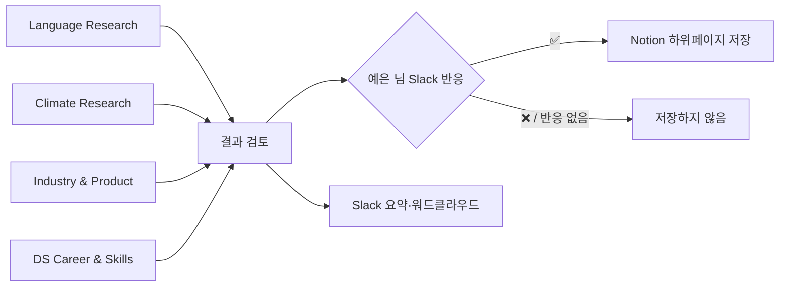

# 서브에이전트 뉴스레터 워크플로

매주 월요일 오전 9시 실행에서는 **조사 담당 4명 → 결과 검토 1명 → Slack 발송 1명** 순서로 진행한다. 조사 담당은 서로 독립적으로 동시에 시작한다. 검토와 발송은 앞 단계가 끝나기 전 시작하지 않는다.

## 공통 입력과 출력

- 입력 기간: 실행 시점 기준 최근 7일. 날짜를 확인할 수 없는 자료는 자동 후보에서 제외한다.
- 모든 후보에는 제목, 발표·게시일, 원문 URL, 출처 종류, 도메인, 1~2줄 요약, 원문에서 확인한 근거 위치를 둔다.
- URL → DOI/arXiv ID → 정규화 제목+기관 순으로 기존 Notion과 이번 실행 후보를 비교한다.
- 정보가 약하거나 새로움이 없으면 0건으로 끝낸다. 항목 수를 맞추지 않는다.
- 각 결과에는 반드시 `논문/원문이 직접 말한 사실`, `실험·데이터가 보여주는 사실`, `해석`을 구분한다.

## 1. 병렬 조사 담당

### Language Research 담당

- Language/NLP/LLM의 최근 논문·공식 연구 발표만 조사한다.
- 논문마다 아래의 **논문 분석 3인조** 결과를 합쳐 하나의 후보 보고서를 만든다.
- 저장이 승인되면 `Language Research` 아래 개별 하위페이지로 정리한다.

### Climate Research 담당

- Climate/Weather/Environmental AI의 최근 논문·기관 발표만 조사한다.
- 논문마다 아래의 **논문 분석 3인조** 결과를 합쳐 하나의 후보 보고서를 만든다.
- 저장이 승인되면 `Climate Research` 아래 개별 하위페이지로 정리한다.

### Industry & Product Signals 담당

- 실제 제품·서비스·데이터·인프라 운영 변화가 확인되는 기사와 기업 기술 글만 조사한다.
- 후보마다 무엇이 만들어졌는지, 운영·제품 변화, 근거 수치, DS 의미, 과장 가능성을 정리한다.
- 모델 출시 자체는 충분한 제품·운영 근거가 있을 때만 포함하며, 별도 Model Radar를 만들지 않는다.
- 저장이 승인되면 `Industry & Product Signals` 아래 개별 하위페이지로 정리한다.

### DS Career & Skills 담당

- 한국 근무의 신입·체험형 인턴, 또는 한국인 대상 해외취업 중 날짜·전형·근무지를 확인할 수 있는 공식 공고만 조사한다.
- 공고마다 마감일, 기업 구분, 근무지·형태, 전형 절차, 필수/우대 역량, 원문 URL을 확인한다.
- 예은 님 포트폴리오의 LLM·ASR 품질 평가 및 개선, 모델 경량화, 기후 프로젝트, 수요예측·텍스트 분석 경험과 연결해 `서류에서 강점이 되는 근거`와 `보완할 점`을 구분한다. 확인되지 않은 개인 경험은 만들지 않는다.
- 저장이 승인되면 `DS Career & Skills → 채용 공고` 아래 개별 하위페이지로 정리한다.

## 2. 논문 분석 3인조

논문이 후보를 통과했을 때에만 아래 세 역할을 병렬로 실행한다. 셋의 결과가 모일 때까지 기다린 후, Language 또는 Climate 담당이 원문을 기준으로 충돌을 조정한다.

| 역할 | 맡길 일 | 반드시 남길 것 |
|---|---|---|
| 구조·핵심 내용 분석 | Problem, Contribution, Method, Experiments, Limitations | Section/Page 근거와 논문 전체 흐름 |
| 배경지식 조사 | 선수 개념, 용어, 읽기 전 알아야 할 내용 | Glossary와 추가 학습 필요 표시 |
| 근거·세부 검증 | Figure, Table, 수식·Notation, 주장과 근거 연결 | 약한 근거·검증되지 않은 주장 표시 |

통합 보고서는 `notes/[concept-name]-report.md`에 아래 순서로 쓴다.

1. Executive Summary
2. Glossary
3. Paper Walkthrough (문제 정의, 기존 접근, 핵심 아이디어, 방법, 실험, 결과, 한계)
4. Concept Map
5. Method Diagram
6. Evidence Table (주장 / 근거 / Section·Page·Figure·Table / 주의점)
7. Caveats
8. Open Questions
9. Follow-up Reading

시각화는 구조가 충분히 단순할 때만 Mermaid를 사용한다. 논문 Figure를 재현하지 않으며, 설명용 그림은 원문 그림과 구분해 `개념 설명용`이라고 표시한다.

## 3. 결과 검토 담당 (조사 완료 후)

앞의 네 조사 결과를 새로 조사하지 않고, 아래만 검토한다.

1. URL·DOI·제목 기준의 중복과 이미 Notion에 있는 자료인지 확인
2. 최근 7일 기준과 날짜·출처·원문 URL 존재 여부 확인
3. 제목·요약·핵심 주장과 원문 발췌가 일치하는지 확인
4. 논문 주장 / 실험 결과 / 해석이 섞이지 않았는지 확인
5. 회사의 성능 주장을 독립 검증처럼 표현하지 않았는지 확인
6. Career 항목의 마감일·근무지·전형과 포트폴리오 연결 근거 확인

통과하지 못한 후보는 `rejected` 또는 `later`와 이유를 붙여 Slack·Notion 대상에서 제외한다. 검토 담당은 새 후보를 억지로 추가하거나 사람의 승인 결정을 대신하지 않는다.

## 4. Slack 발송 담당

- 검토 통과 후보를 도메인별로 최대 2개씩, 항목 하나당 별도 Slack 메시지로 보낸다.
- 형식: `제목` + 1~2줄 한국어 요약 + 원문 링크 + `결정: ✅ Notion에 저장 / ❌ 제외 / 🕒 다음 주 재검토`.
- Industry 후보가 있으면 해당 주의 첫 Industry 메시지에 승인/검토 대상 기준을 명시한 PNG 워드클라우드를 첨부한다.
- 다음 월요일 실행에서 지난주 메시지의 ✅ 반응만 Notion 하위페이지로 저장한다. ❌·🕒·반응 없음은 저장하지 않는다.
- 강한 후보가 하나도 없으면 “이번 주는 저장·전송할 만큼 강한 새 자료가 없습니다”만 보낸다.
